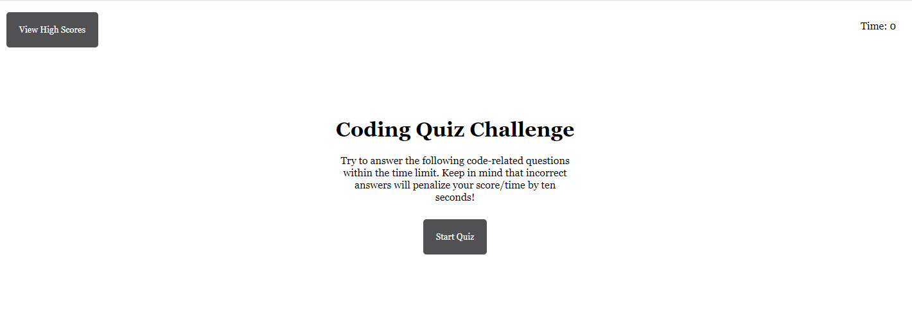

# MyWebAPICodingQuiz

## Description

This project involves creating a coding assessment that includes multiple-choice questions and interactive challenges. The objective is to develop a timed code quiz with multiple-choice questions. The app runs in the browser, featuring dynamically updated HTML and CSS powered by your JavaScript code, and has a clean, polished, and responsive user interface that adapts to various screen sizes.

This timed code quiz is designed for coding bootcamp students who want to take a JavaScript fundamentals quiz that stores high scores, allowing them to track their progress and compare it with their peers.

The quiz includes:

- 5 questions in a timed manner, which decreases the time by 10 seconds with each incorrectly answered question.
- When all questions are either answered or time runs out, the game is over and a page renders, allowing the user to input their initials (maximum of 3 characters) to save their score.

## Screenshot

## Link to video

## Table of Contents
- [Description](#description)
- [Screenshot](#screenshot)
- [Link to video](#link-to-video)
- [Installation](#installation)
- [Licence](#license)
- [Contributing](#contributing)
- [Questions](#questions)

## Installation
Launch the timed code quiz in default web browser.

## License
 
  This project is licensed under the MIT license.  

## Contributing
For contributions, please contact me directly.

## Questions
If you have any questions I may or comments, be contacted at [GitHub](https://github.com/cdepalma32) or by [email](mailto:crystaldepalma@yahoo.com).

